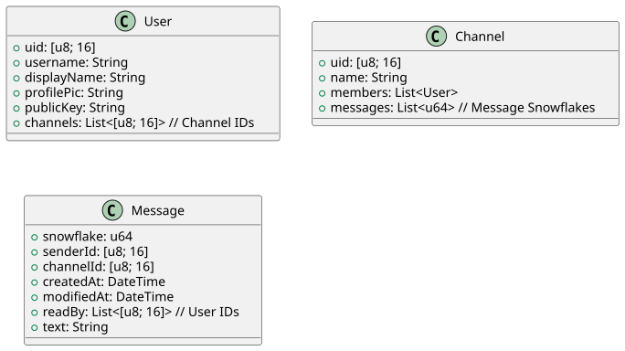
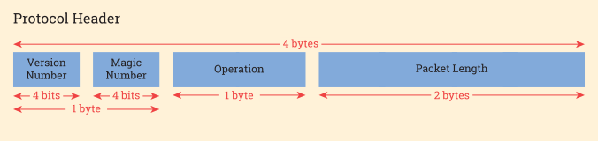

# Engineering Notebook - RPC

## 02/21/2025 : Deliverables for Design Problem 2

Today we met to brainstorm some of the additions which must be made to accommodate gRPC message passing, rather than our custom scheme. Currently, we believe that necessary changes include the following:

* Add `.proto` files encoding each message in `message/`
* In `tcp_client.cpp`, we must change the implementation to use gRPC service functions. 
* In `client_handler.hpp`, we need to use Asynchronous calls, since we don't immediately generate a response. Whenever we write data, we need to wrap the emit in the corresponding RPC call.
* In `message_handlers`, all the backend logic stays the same, but rather than reading a custom message / writing to a custom message, we read and write to RPC classes.
* We need ways to parse RPC data as our custom objects; e.g. `RPC_to_user`, `RPC_to_message`, `RPC_to_channel`


In the following section, we answer each of the questions listed in the assignment description.

## Question : Does the use of gRPC make the application easier or more difficult?

In general, it was a little bit of a slog to convert to gRPC, but this was mostly due to the fact that we had to alter an existing code base.

We think that, if we had reimplemented the problem from scratch using gRPC instead of the custom wire protocol, it would have almost certainly been faster, as it abstracts away some tedious parts of the implementation (e.g. serialization, creating / attaching to sockets) which took us a bit of effort in design project 1. 

However, since we were inheriting a code base designed with sockets and serialization/deserialization in mind, switching to gRPC actually required us to reimplement a lot of code. For example, many of the functions that we used to process messages and change the backend database were handled uniformly by a single message handler, and as a result we assumed they would all have a particular input (a message reference and a socket). In addition, we also made assumptions about what the message data would contain (i.e. properties of the class that we could index into). Semantically, we basically didn't need to change anything, but to work with the API of gRPC, we basically had to rewrite all of these components.

This was a markedly different from adding JSON serialization&mdash;that required comparatively little effort (just infrastructure for serializing/deserializing each message using the new scheme). 

## Question : What does it do to the size of the data passed?

TBD.

## Question : How does it change the structure of the client and/or server?

As mentioned above, we had to make pretty significant changes to both the client and the server to incorporate gRPC. 


Another significant problem was figuring out how to asynchronously send messages. Our existing code assumed that we could stream data over sockets&mdash;this made it really simple to do things like retrieve all messages on login. However, the documentation for gRPC doesn't make celar how to best achieve this functionality, which made some of the components of the system hard to re-implement. 


## Question : How does this change the testing of the application?

The largest change is that we can shift the focus of our tests from serialization/deserialization bugs to higher-level errors. In design project 1, many of our bugs early on were due to small errors or typos in serialization (for example, storing a number at an incorrect offset in the buffer). gRPC basically eliminated this issue, which allowed most of the remaining tests to focus on the performance of our handlers.


# Engineering Notebook - Wire Protocols

## Tuesday, February 4th, 2025

Today, we came up with a rough sketch of the functionality our chat app wants to support, what the major classes should look like, the procedure's we'd need to support, and a rough sketch of what our wire protocol should look like.

We aim to have three major classes corresponding to three tables in our file-backed database: `User`, `Channel`, and `Message`. `User`s and `Message`s obviously correspond to accounts and the messages sent between accounts, however, it may not be obvious what `Channel`s correspond to. `Channel`s are supposed to represent a collection of people that can send messages to each other. We use this abstraction to support having group DMs.

<div style="display: none">

    ```
    @startuml diagrams/basicClassDiagram

        class User {
             + uid: [u8; 16]
             + username: String
             + displayName: String
             + profilePic: String
             + publicKey: String
             + channels: List<[u8; 16]> // Channel IDs
        }

        class Channel {
            + uid: [u8; 16]
            + name: String
            + members: List<User>
            + messages: List<u64> // Message Snowflakes
        }

        class Message {
            + snowflake: u64
            + senderId: [u8; 16]
            + channelId: [u8; 16]
            + createdAt: DateTime
            + modifiedAt: DateTime
            + readBy: List<[u8; 16]> // User IDs
            + text: String
        }

    @enduml
    ```

</div>

<div align=center>
    
</div>

Passwords will be stored in a separate table alongside the username. We'll use some cryptographic hash algorithm alongside a server-side generated unique salt for each user and a secret pepper stored in the server config for security.

Furthermore, currently, we plan to support profile pictures by storing a base64 encoding of the image, which for small enough image sizes should be fine.

We do want to support end-to-end encryption. To this end, private keys will be saved in a special directory (`~/.cache`).

As for desired functionality, we came up with the following list of operations from the assignment specification along with some additional operations we'd like to support (along with their proposed operation code):

We will likely impose a size limit for a message's text in characters (bytes). Something like 280 characters seems reasonable.

<table align=center>
    <tr>
        <th>Requirements</th>
        <th>Additional Features</th>
    </tr>
    <tr>
        <td>Registering an account [0]</td>
        <td>Editing a message [7]</td>
    </tr>
    <tr>
        <td>Logging into an account [1]</td>
        <td>Marking a message unread [8]</td>
    </tr>
    <tr>
        <td>Listing all accounts [2]</td>
        <td>Updating channel names [9]</td>
    </tr>
     <tr>
        <td>Deleting an account [3]</td>
        <td>Updating display names [10]</td>
    </tr>
    <tr>
        <td>Sending a message [4]</td>
        <td>Updating profile pictures [11]</td>
    </tr>
    <tr>
        <td>Receiving messages [5]</td>
        <td>Resetting a password [12]</td>
    </tr>
    <tr>
        <td>Deleting a message [6]</td>
        <td></td>
    </tr>
</table>

> [!NOTE]
> We had the exact same question in our initial reading of the assignment specification, and therefore, will be following this [EdPost](https://edstem.org/us/courses/69416/discussion/6104805) closely.

Finally, we came up with the following 4 byte header for our wire protocol.

<div align=center>
    
</div>

It actually turns out Qt is much more than a GUI library! Instead of using raw Unix sockets we'll instead choose to subclass the Qt based sockets! This simplifies a lot of the inter-thread communication since Qt allows us to use an event driven framework.

This does mean we no longer need to have a separate thread for the GUI and the communication with the server process, which simplifies synchronoization on the client.

We ahve also decided we won't multiplex clients on the server threads for now, since it seems overkill for our currnet implementation

Synchronoizaton of the database isn't necessarily our priority as well, so we should theooretically come back to this if there seem to be issues if there are a lot of users.

On average, empiracally it seems that our basic messages (that don't very due to text size) have an average length of 15 bytes with our custom wire protocol, and our JSON based protocol sees an increase in the averagle length to be approximately 80 bytes. What this ends up looking like is that our loading spinners tend to be more visible in the JSON based implementation than the custom implementation. This is especially apparaent as the number of concurrent users increases and more channels are added.

