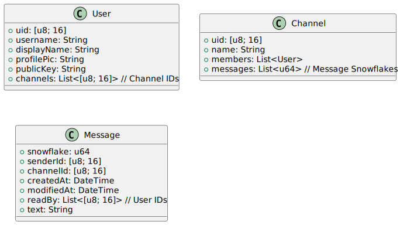

# Engineering Notebook - Wire Protocols

## Tuesday, February 4th, 2025

Today, we came up with a rough sketch of the functionality our chat app wants to support, what the major classes should look like, the procedure's we'd need to support, and a rough sketch of what our wire protocol should look like.

We aim to have three major classes corresponding to three tables in our file-backed database: `User`, `Channel`, and `Message`. `User`s and `Message`s obviously correspond to accounts and the messages sent between accounts, however, it may not be obvious what `Channel`s correspond to. `Channel`s are supposed to represent a collection of people that can send messages to each other. We use this abstraction to support having group DMs.

<div hidden>

    ```
    @startuml diagrams/basicClassDiagram

        class User {
             + uid: [u8; 16]
             + username: String
             + displayName: String
             + profilePic: String
             + publicKey: String
             + channels: List<[u8; 16]> // Channel IDs
        }

        class Channel {
            + uid: [u8; 16]
            + name: String
            + members: List<User>
            + messages: List<u64> // Message Snowflakes
        }

        class Message {
            + snowflake: u64
            + senderId: [u8; 16]
            + channelId: [u8; 16]
            + createdAt: DateTime
            + modifiedAt: DateTime
            + readBy: List<[u8; 16]> // User IDs
            + text: String
        }

    @enduml
    ```

</div>

<center>
    
</center>

Passwords will be stored in a separate table alongside the username. We'll use some cryptographic hash algorithm alongside a server-side generated unique salt for each user and a secret pepper stored in the server config for security.

Furthermore, currently, we plan to support profile pictures by storing a base64 encoding of the image, which for small enough image sizes should be fine.

We do want to support end-to-end encryption. To this end, private keys will be saved in a special directory (`~/.cache`).

As for desired functionality, we came up with the following list of operations from the assignment specification along with some additional operations we'd like to support (along with their proposed operation code):

We will likely impose a size limit for a message's text in characters (bytes). Something like 280 characters seems reasonable.

<table style="margin: auto;">
    <tr>
        <th>Requirements</th>
        <th>Additional Features</th>
    </tr>
    <tr>
        <td>Registering an account [0]</td>
        <td>Editing a message [7]</td>
    </tr>
    <tr>
        <td>Logging into an account [1]</td>
        <td>Marking a message unread [8]</td>
    </tr>
    <tr>
        <td>Listing all accounts [2]</td>
        <td>Updating channel names [9]</td>
    </tr>
     <tr>
        <td>Deleting an account [3]</td>
        <td>Updating display names [10]</td>
    </tr>
    <tr>
        <td>Sending a message [4]</td>
        <td>Updating profile pictures [11]</td>
    </tr>
    <tr>
        <td>Receiving messages [5]</td>
        <td>Resetting a password [12]</td>
    </tr>
    <tr>
        <td>Deleting a message [6]</td>
        <td></td>
    </tr>
</table>

> [!NOTE]
> We had the exact same question in our initial reading of the assignment specification, and therefore, will be following this [EdPost](https://edstem.org/us/courses/69416/discussion/6104805) closely.

Finally, we came up with the following 4 byte header for our wire protocol.


